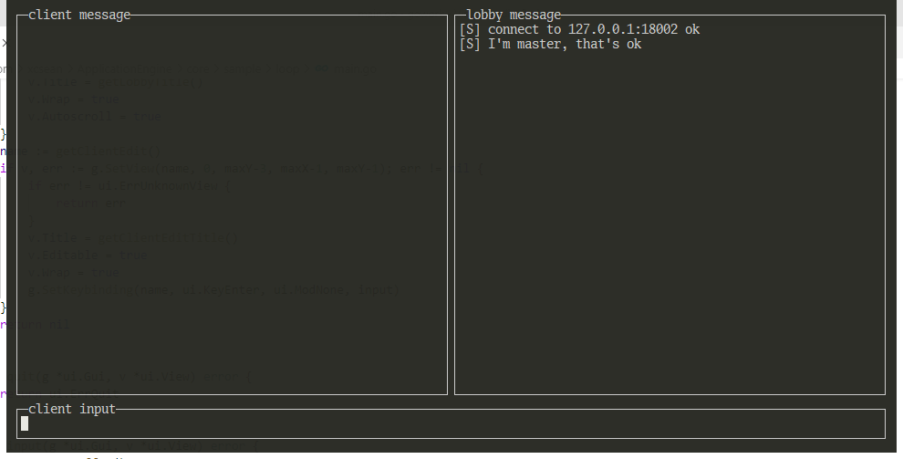

# Sample
* Loop has a client routine to connect to gconnd, while it also has a lobby routine connected to gconnd
* Vmcli has a client routine to connect to gconnd, while it also has a vm routine connected to ghost

## Loop
* install dependencies
```
go get -u github.com/jroimartin/gocui
```
* compile
```
cd loop
go build
```
* run
```
./loop 192.168.1.10 18001 18002
```

while 192.168.1.10 is the ip address of gconnd, port 18001 is the client port of gconnd, 18002 is the server port
* test

loop has a Console-UI, you could type command in the 'client input' at bottom, such as 'conn', 'disc'

