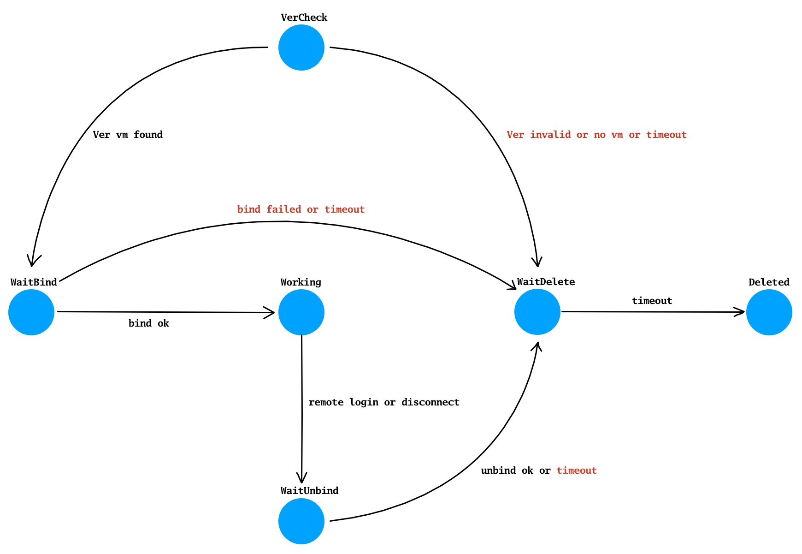

# Core Service

## Directory
* getcd, means 'go-etc-daemon', provides configuration service
* gconnd, means 'go-connection-daemon', provides connection-oriented features
* gconnless, means 'go-connection-less', provides connectionless features
* ghost, means 'go-host', provides vm management & packet forwarding & data storage features
* ws2tcp provides websocket to tcp conversion

## getcd
* service configuration
* server configuration
* global configuration
* protocol limit configuration

## gconnd
* connection-oriented
* packet forwarding to backend or frontend by sequence
* broadcast to the frontend(s) specified
* notify to the frontend(s) specified
* enter/leave notification to backend
* keep-alive check such as ping/pong
* traffic statistics

## ghost
* vm register & unregister interface
* notify status to vm(s) registered
* packet forwarding between vm(s) and client(s)
* asset data save to database and load interface exported to vm(s)
* protocol frequency limitation and protection for vm(s)
* overload protection

### session state transform
